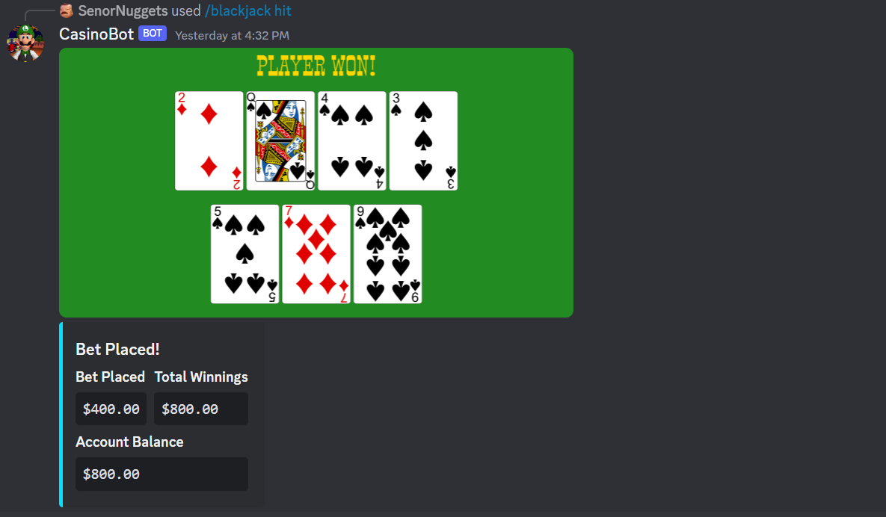
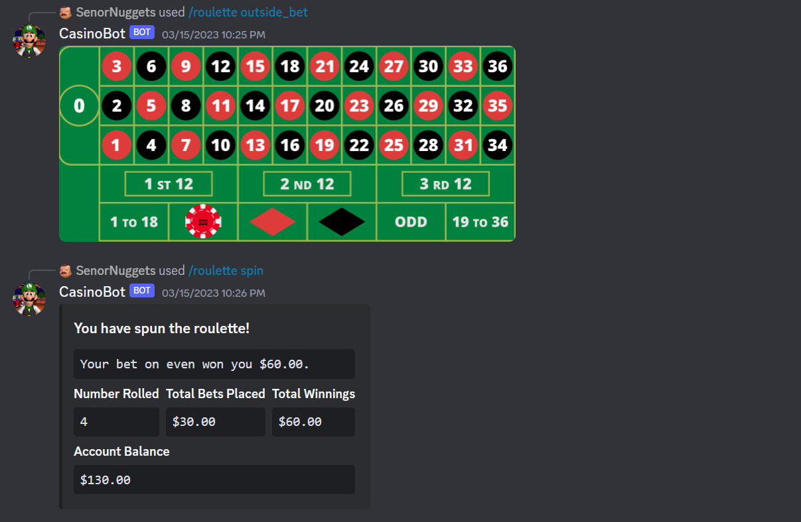

# Casino Bot for Discord





## Linux Setup

This tutorial assumes you already have a MySQL database running with a schema named `discord`. If you wish to use a different schema name or database altogether, change the connection string supplied to `create_engine()` in `./models/model.py`.

To setup the casino bot in a Linux environment, begin by cloning the repository. Create a virtual environment and install the dependencies from `requirements.txt`. If there is an issue installing mysqlclient you may need to install [the Python3 and MySQL development headers and libraries](https://pypi.org/project/mysqlclient/#:~:text=You%20may%20need%20to%20install%20the%20Python%203%20and%20MySQL%20development%20headers).

```bash
git clone https://github.com/HEXecuter/DiscordCasinoBot.git
cd ./DiscordCasinoBot/
python3 -m venv env
source env/bin/activate
sudo apt-get install python3-dev default-libmysqlclient-dev build-essential
pip install -r requirements.txt
deactivate
```

Create a `.env` file in the root directory of the project with the following environment variables. The `CASINO_TOKEN` environment variable is the auth token for your discord bot.

```env
CASINO_TOKEN="CHANGE ME"
CASINO_DEBUG="CHANGE ME"
CASINO_LOCALE="en_US.UTF-8"
CASINO_DB_HOST="CHANGE ME"
CASINO_DB_PORT="CHANGE ME"
CASINO_DB_USER="CHANGE ME"
CASINO_DB_PASSWORD="CHANGE ME"
```

If you wish to run the discord bot as a service on your linux server, populate the `casino-discord-bot.service` file. Then copy this file into `/etc/systemd/system/`. Enable the service and start it.

```bash
sudo cp ./DiscordCasinoBot/casino-discord-bot.service /etc/systemd/system/
sudo systemctl enable discod-casino-bot
sudo systemctl start casino-discord-bot.service
```

Below is an example of a populated `casino-discord-bot.service` file. You should execute the python interpreter located in your virtual environment, instead of your global interpreter.

```YAML
[Unit]
Description=Discord bot written in python for playing casino games
After=network.target mysql.service

[Service]
Type=simple
WorkingDirectory=/home/MY_USERNAME/DiscordCasinoBot/
ExecStart=/home/MY_USERNAME/DiscordCasinoBot/env/bin/python3.10 /home/MY_USERNAME/DiscordCasinoBot/main.py
Environment=PYTHONBUFFERED=1
Restart=always
RestartSec=60

[Install]
WantedBy=multi-user.target
```

## General Game Loop

Players sign up using the `/account create` command. All account related subcommands can be accessed through the `/account` command. The player can sign up for a job and receive pay checks every 10 minutes. The player can purchase degrees to increase their pay. Job related subcommands are found under the `/job` command.

The player can start a Blackjack game by betting an initial amount. The bot will deal two cards to the house and two cards to the player. The house's second card will remain hidden until the player ends their turn. The bot will determine whether an ace is worth 11 or 1 points by trying to get the value as close to 21 without going over. A player can hit to receive another card, or stand to stop receiving cards and end their turn. In any situation where the player can hit, they may choose to double down instead. This doubles the player's bet, deals another card to the player, and immediately ends their turn. When a player ends their turn either by busting, standing, or doubling down, the house will reveal their second card and continue drawing cards until they have a minimum of 17 points. The house will then end its turn and a winner is calculated. Blackjack related subcommands are found under the `/blackjack` command.

The player can start a Roulette game by placing an inside or outside bet. Outside bets are placed on a group of numbers and have different payouts based on their probability. Inside bets are placed on individual numbers and pay 35 to 1. Multiple bets can be placed on a roulette table before spinning. Once the roulette is spun, the payouts are calculated and paid to the player. Roulette related subcommands can be found under the `/roulette` command.

## Libraries and Technologies Used

- Python
- MySQL
- SQLAlchemy (ORM)
- PIL for image processing